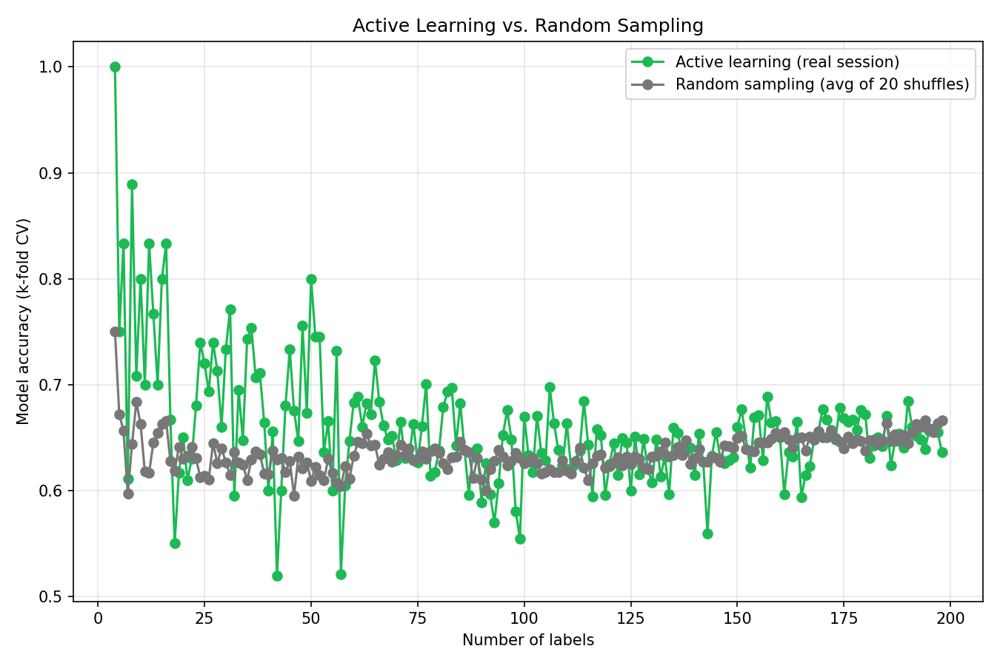
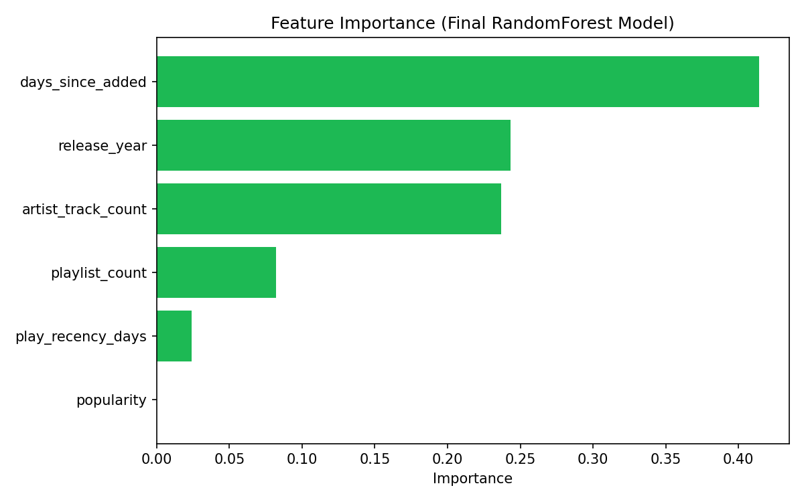

# Spotify ML Portfolio Project

A Spotify taste-modeling pipeline: swipe Keep/Remove on your own saved tracks,
playlists, and albums, and an active-learning classifier figures out what you
actually keep — while every Remove is a real, live action against your Spotify
library, not a simulation.

**🔗 Live demo:** [spotify-taste-pipeline-rarbusmzvya9shyvgj9lxk.streamlit.app](https://spotify-taste-pipeline-rarbusmzvya9shyvgj9lxk.streamlit.app)
— log in with your own Spotify account to try it against your own library (your
swipes stay in your session only; see [Multi-user deployment](#multi-user-deployment-owner-vs-testers) below).

<p align="center">
  
</p>

Active learning (green) tracks above random sampling (gray) most clearly
through the first ~50 labels of a real 198-label swiping session, holding a
lead of roughly 10-15 accuracy points — the uncertainty-sampling loop is
picking up signal faster than chance early on, not just going in order. After
that the two curves interleave and largely converge for the rest of the
session, as both models level off around the same accuracy once there's
enough data either way.

### Model performance over time

Lift over the majority-class baseline actually *shrank* as the dataset grew —
+20pts at 35 labels, down to +7.7pts at 196. That's not a regression; it's
what happens when more data pushes the Keep/Remove split closer to 50/50,
which raises the baseline's own accuracy and makes it a harder target to
beat. The absolute model accuracy stayed in a similar range throughout (74% →
66%); what changed was how impressive that number looks next to an
increasingly competitive baseline. Reporting the honest number here rather
than the flashier early one.

A simpler model tells an interesting side story here too: run head-to-head on
the same 198 labels with identical k-fold splits, a plain logistic regression
actually edges out the RandomForest used in the live app — 68.6% vs 63.6%
accuracy, both against a 58.6% majority-class baseline. The two models also
disagree on what matters most: logistic regression's strongest signal is
`play_recency_days` and `playlist_count`, while the RandomForest leans
hardest on `days_since_added` and `release_year`. That's not a case for
switching — RandomForest stays the model driving the live active-learning
loop, feature importance chart, and taste summary above, kept for its
non-linear splits and its role in that interpretability story — but it's a
genuine finding about how model choice changes which signal gets surfaced
from the same data.

### What the model learned about my taste

> You're a listener who treasures a mix of mainstream hits and regional gems...
> When it comes to what you keep, the data tells a tidy story: you keep tracks
> that you added more recently (median 911 days ago) and you tend to favor
> older music overall (median release in 2018 versus 2020 for removed tracks)...
> You're also a fan of deeply familiar artists — tracks from artists you've
> saved dozens of songs for (average 10 tracks) are more likely to stay in your
> library than those from newer or less-traveled acts (average 5.2 tracks).
>
> — [`data/listener_summary.md`](data/listener_summary.md), generated by `insights.py` from my real 198-label session

<p align="center">
  
</p>

The strongest signal by far is how recently a track was added, followed by
release year and how many other tracks I've saved from the same artist —
`insights.py` and [`data/taste_summary.md`](data/taste_summary.md) turn that
into the plain-English summary above.

### Built against a live, changing API

Spotify deprecated or restructured several endpoints mid-project —
`audio-features` and artist genre lookups were removed for apps without
Extended Quota approval, `playlist_items` responses were restructured, and
`/users/{id}/playlists` was fully retired for playlist creation as of March
2026. Each one broke something real; each fix is documented in the commit
history rather than silently patched over.

---

- **Phase 1** (`spotify_client.py`, `features.py`): pulls your saved tracks plus
  metadata and behavioral signals (recency, playlist co-occurrence, artist
  frequency) into one clean, cached `data/tracks.csv`.
- **Phase 2** (`app.py`): a Streamlit swipe UI (Keep/Remove) that labels tracks into
  `data/labels.csv` and, after a short bootstrap, uses active learning (uncertainty
  sampling with a RandomForestClassifier) to pick which track to show next. Remove
  is a live action — it also unsaves the track from your actual Spotify library.
  Now a two-screen flow (gallery of playlists/albums → scoped swipe session) with
  per-visitor login for multi-user deployment — see below.
- **Phase 3** (`evaluate.py`): trains a final model on your collected labels,
  compares it to a majority-class baseline, simulates a random-sampling accuracy
  curve for comparison against the real active-learning session, and charts
  feature importance.
- **Phase 4** (`evaluate.py`): turns those feature importances into a short,
  plain-English write-up of what the model learned about your taste, saved to
  `data/taste_summary.md`.

Audio-features (danceability, energy, valence, etc.), `preview_url`, and artist
genre data are **not** used anywhere in this project — all three require Spotify
endpoints (`audio-features`, `artists`) that 403 for apps without Extended Quota
Mode approval, which personal/hobby apps don't get. All signal instead comes from
track metadata and your own behavior (recently played, playlists, saves).

<details>
<summary><strong>Full setup instructions</strong> (Spotify credentials, local dev, deployment)</summary>

## Setup

### 1. Get Spotify API credentials

1. Go to the [Spotify Developer Dashboard](https://developer.spotify.com/dashboard)
   and log in with your Spotify account.
2. Click **Create app**.
3. Fill in a name/description (anything you like).
4. Under **Redirect URIs**, add `http://127.0.0.1:8501` (this is what both
   `python features.py` and `streamlit run app.py` use locally — see the note
   below on why this changed from the previous loopback-port setup). You can
   register multiple redirect URIs on the same app, so add the deployed
   Streamlit Cloud URL here too once you have it (Deployment section below).
5. Check the box for the Web API, agree to the terms, and click **Save**.
6. Open the app you just created, click **Settings**, and copy the **Client ID**
   and **Client Secret**.
7. Under **User Management**, add up to 4 tester Spotify accounts (by email) if
   you want friends to be able to log in — this app is in Development Mode, which
   caps access to an explicit allowlist of 5 accounts (you + 4 testers). You,
   the app owner, already have implicit access and don't need to add yourself.

### 2. Configure environment variables

Copy the example env file and fill in the values from the previous step:

```bash
cp .env.example .env
```

`.env` needs:

| Variable | Description |
|---|---|
| `SPOTIFY_CLIENT_ID` | Client ID from the Spotify Developer Dashboard |
| `SPOTIFY_CLIENT_SECRET` | Client Secret from the Spotify Developer Dashboard |
| `SPOTIFY_REDIRECT_URI` | Must match a URI registered in the dashboard exactly. Locally: `http://127.0.0.1:8501`. Deployed: the Streamlit Cloud URL. |
| `OWNER_SPOTIFY_ID` | Your Spotify user ID — see "Multi-user deployment" below for how to get it. Determines whose data persists to disk. |

`.env` is gitignored — never commit real credentials.

**Why the redirect URI changed from `http://127.0.0.1:8888/callback`:** the old
value only ever worked because `python features.py`'s login flow lets you
manually paste the redirected URL into the terminal — nothing needed to be
listening on that port. `app.py`'s per-visitor login flow (added for multi-user
deployment) instead reads the `code` directly from the page's URL after Spotify
redirects back, which only works if Spotify actually redirects to the Streamlit
app's own address. `python features.py` still works fine with the new value too
(the manual-paste flow doesn't care what's listening there), so one redirect URI
now covers both.

### 3. Install dependencies

```bash
python3 -m venv .venv
source .venv/bin/activate
pip install -r requirements.txt
```

## Running Phase 1 — the data pipeline

```bash
python features.py
```

On first run, a browser window will open asking you to log in to Spotify and
authorize the app (scopes: `user-library-read`, `user-library-modify`,
`user-read-recently-played`, `user-top-read`, `playlist-read-private`,
`playlist-read-collaborative`, `playlist-modify-public`, `playlist-modify-private`).
After authorizing, you'll be redirected to `http://127.0.0.1:8501/?code=...`;
if `streamlit run app.py` isn't also running at that moment, the page won't
load — that's fine, copy the full URL from the browser's address bar and paste
it at the terminal prompt. Your auth token is then cached locally in
`.spotify_token_cache` so you won't have to log in again on future CLI runs.

The script will:
1. Fetch all your saved tracks (paginated, cached to `data/raw_tracks.json`).
2. Fetch your recently played tracks (cached to `data/raw_recently_played.json`).
3. Fetch your playlists and each playlist's track IDs (cached to
   `data/raw_playlists.json`). Playlists you don't own or collaborate on will be
   skipped with a printed note — Spotify no longer returns their contents.
4. Combine everything into one dataframe and save it to `data/tracks.csv`.
5. Print a summary: total tracks pulled, how many made it into the final
   dataframe, and how many were dropped (local files/podcasts have no usable
   track ID).

Re-running `python features.py` reuses the cached JSON files instead of
re-hitting the Spotify API. Delete the relevant file(s) in `data/`, or pass
`force_refresh=True` to `run_pipeline()`, to force a refetch.

## Running Phase 2 — the swipe UI

```bash
streamlit run app.py
```

Requires `data/tracks.csv` to already exist (run Phase 1 first, at least once,
as the owner). On load, every visitor sees a **"Log in with Spotify" button** —
clicking it opens Spotify's consent screen in the same tab; after approving,
you're redirected straight back into the app, already logged in (no terminal
interaction needed here, unlike the CLI flow above).

After logging in, you land on a **gallery**: your owned playlists, saved albums,
and an "All Liked Songs" card, each showing cover art and track count. Pick one
to start a swipe session scoped to just that collection's tracks. Swipe
Keep/Remove one at a time; the first 20 labels (globally) are random order to
bootstrap a model, after which each swipe retrains a RandomForestClassifier on
labels-so-far and picks whichever unlabeled track in the current collection the
model is most uncertain about. A "← Back to gallery" link lets you switch
collections without losing progress.

**Remove is a live action against Spotify, and what it does depends on context:**
- **All Liked Songs**: unsaves the track from your Liked Songs.
- **A playlist you own**: removes the track from that playlist by default. A
  sidebar toggle — "Remove from this playlist" vs "Also unsave from Liked
  Songs" — lets you switch mid-session; it's read fresh on every click.
- **A saved album**: individual tracks can't be stripped from a saved album via
  the API, so Remove falls back to unsaving the track from Liked Songs instead,
  with a caption explaining why.

### Multi-user deployment: owner vs. testers

`app.py` is built to be deployed somewhere multiple people can visit (e.g.
Streamlit Cloud) and each log in with their own Spotify account:

- **Auth is per-session.** Each visitor's OAuth token lives only in their own
  browser session (`StreamlitSessionCacheHandler` in `spotify_client.py`) — never
  written to disk, never shared with another visitor. This is separate from the
  `.spotify_token_cache` file, which only `python features.py` (a single-user
  CLI tool) uses.
- **You (`OWNER_SPOTIFY_ID`) get the full persistent experience** — your
  `tracks_df`/`labels_df` load from and save to `data/tracks.csv`,
  `data/labels.csv`, `data/learning_curve.csv` on disk, exactly as before.
- **Anyone else is treated as a tester**: they get the full real experience
  against their *own* Spotify data (their own gallery, swipe queue, active
  learning, and real Remove actions against their own account) — but nothing of
  theirs is written to disk. Their tracks are fetched fresh into memory each
  session, and their labels live only in that session; closing the tab discards
  them entirely.

To find your own Spotify user ID for `OWNER_SPOTIFY_ID`:

```bash
python3 -c "from spotify_client import get_spotify_client; print(get_spotify_client().current_user()['id'])"
```

**A real limitation to know before relying on this in production**: Streamlit
Community Cloud's local filesystem is not guaranteed to persist across app
restarts, redeploys, or the app going to sleep from inactivity. Locally, your
`data/*.csv` writes are genuinely durable. Once deployed, they may not survive
a restart — this design isolates *testers from your data*, but it does not by
itself guarantee your own accumulated labels survive indefinitely on the hosted
platform. If long-term durability on the hosted deployment matters, that needs
an external store (e.g. periodically committing back to git, or a small
database) — not implemented here.

## Deploying to Streamlit Cloud

1. Push this repo to GitHub (already done if you've been following along).
2. **Keep `data/tracks.csv`/`labels.csv`/`learning_curve.csv` current.** These
   three are the only files under `data/` that aren't gitignored (see the
   explicit exceptions in `.gitignore`) — the deployed app has no way to run
   `python features.py` itself, and Streamlit Cloud's filesystem doesn't
   persist across redeploys anyway, so it boots from whatever's last committed.
   Nothing auto-syncs local disk writes back to git — after a local swiping
   session, re-commit them manually before redeploying:
   ```bash
   git add data/tracks.csv data/labels.csv data/learning_curve.csv
   git commit -m "Update data snapshot for deployment"
   ```
   (This ships your saved-tracks metadata and swipe labels in the public repo
   — track/artist names and Keep/Remove decisions, not credentials. Keep the
   repo private if that matters to you.)
3. Go to [share.streamlit.io](https://share.streamlit.io), connect your GitHub
   account, and create a new app pointing at this repo with `app.py` as the
   main file.
4. Before or right after the first deploy, add your secrets in the app's
   **Settings → Secrets** (same keys as `.env`, TOML format):
   ```toml
   SPOTIFY_CLIENT_ID = "..."
   SPOTIFY_CLIENT_SECRET = "..."
   SPOTIFY_REDIRECT_URI = "https://<your-app-name>.streamlit.app"
   OWNER_SPOTIFY_ID = "..."
   ```
5. Copy that same deployed URL into the Spotify Developer Dashboard's
   **Redirect URIs** (alongside the local `http://127.0.0.1:8501` one — you can
   keep both registered). Testers can't log in until this matches exactly.
6. Make sure your (and any testers') Spotify accounts are added under the
   dashboard's **User Management** tab (Setup step 7 above) — Development Mode
   apps only allow allowlisted accounts to authenticate, deployed or not.

</details>
